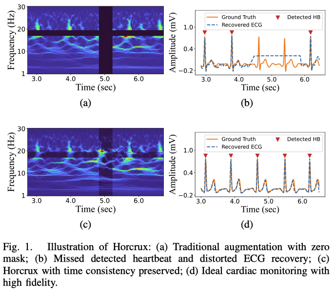

# Horcrux

Official implementation of "Recover from Horcrux: A Spectrogram Augmentation Method for Cardiac Feature Extraction from Radar Signal Components" (EMBC 2025)

The code is written in Jupyter Notebook for easily understanding.

An example of the implementation is shown in [radarODE-MTL](https://github.com/ZYY0844/radarODE-MTL), but **Horcrux** can be easily adapted to your own project with the radar spectrogram as input.

Illustartion of Horcrux with time consistency preserved
